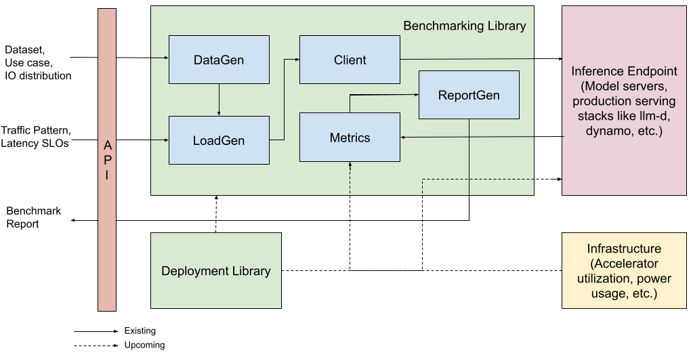
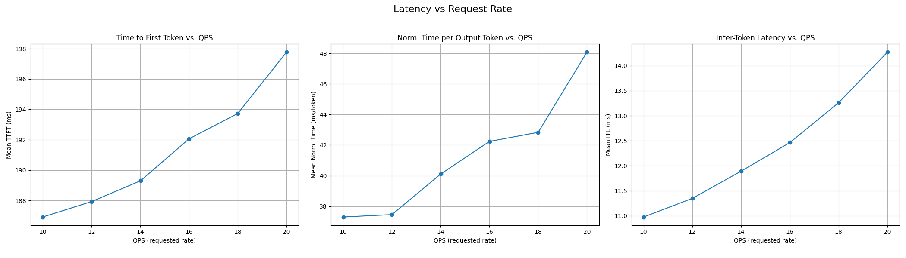
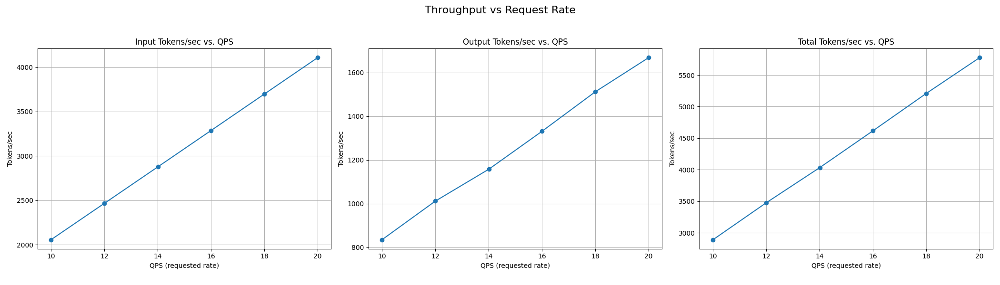
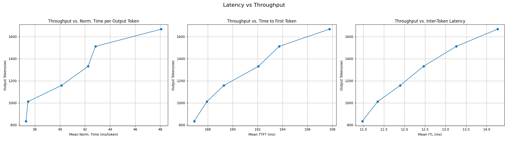

# Inference Perf

Inference Perf is a GenAI inference performance benchmarking tool. It came out of [wg-serving](https://github.com/kubernetes/community/tree/master/wg-serving) and is sponsored by [SIG Scalability](https://github.com/kubernetes/community/blob/master/sig-scalability/README.md#inference-perf). Original proposal can be found [here](https://github.com/kubernetes-sigs/wg-serving/tree/main/proposals/013-inference-perf).

## Architecture



## Key Features

* Highly scalable and can support benchmarking large inference production deployments.
* Reports the key metrics needed to measure LLM performance.
* Supports different real world and synthetic datasets.
* Supports different APIs and can support multiple model servers.
* Supports specifying an exact input and output distribution to simulate different scenarios - Gaussian distribution, fixed length, min-max cases are all supported.
* Generates different load patterns and can benchmark specific cases like burst traffic, scaling to saturation and other autoscaling / routing scenarios.

## Roadmap

* Accelerator metrics collection during benchmarks (GPU utilization, memory usage, power usage, etc.).
* Support for more model servers.
* Deployment API to help deploy different inference stacks.
* Traffic splitting among different use cases or LoRA adapters.
* Support for benchmarking non-LLM GenAI use cases.
* Support for different datasets to simulate real world use cases.
* Replaying traffic from production systems.

## Getting Started

### Run locally

- Setup a virtual environment and install inference-perf

    ```
    pip install .
    ```

- Run inference-perf CLI with a configuration file

    ```
    inference-perf --config_file config.yml
    ```

- See more [examples](./examples/)

### Run in a Docker container

- Build the container

    ```
    docker build -t inference-perf .
    ```

- Run the container

    ```
    docker run -it --rm -v $(pwd)/config.yml:/workspace/config.yml inference-perf

    ```

### Run in a Kubernetes cluster

Refer to the [guide](./deploy/README.md) in `/deploy`.

## Configuration

You can configure inference-perf to run with different data generation and load generation configurations today. Please see `config.yml` and examples in `/examples`.

Refer to the [CONFIG.md](./CONFIG.md) for documentation on all supported configuration options.

### Datasets

Supported datasets include the following:
- [ShareGPT](./examples/vllm/config.yml) (for a real world conversational dataset)
- [Synthetic](./examples/vllm/config-synthetic.yml) (for specific input / output distributions with Sonnet data)
- [Random](./examples/vllm/config-random.yml) (for specific input / output distributions with random data)
- [SharedPrefix](./examples/vllm/config-shared-prefix.yml) (for prefix caching scenarios)
- mock (for testing)

### Load Generators

Multiple load generators are supported:
- Poisson / constant-time load generation to send specific QPS.
- Multi-process load generation for increased concurrency and higher QPS.

Multiple load patterns can be specified:
- Stages with configurable duration and QPS along with specific timeouts in between them allows you to simulate different load patterns like burst in traffic, constantly increasing load till hardware saturation, etc.

### API

OpenAI completion and chat completion APIs are supported. It can be pointed to any endpoints which support these APIs - currently verified against vLLM deployments. Other APIs and model server support can be added easily.

### Metrics

Different latency and throughput metrics to analyze the performance of different LLM workloads are reported. A snippet from an example report is below.
```
"latency": {
    "request_latency": {
        "mean": 3.31325431142327,
        "min": 1.62129471905064,
        "p10": 1.67609986825846,
        "p50": 2.11507539497688,
        "p90": 5.94717199734878,
        "max": 6.30658466403838
    },
    "normalized_time_per_output_token": {
        "mean": 0.104340420636009,
        "min": 0.0506654599703325,
        "p10": 0.0523781208830769,
        "p50": 0.0670631669655753,
        "p90": 0.189047570470012,
        "max": 0.20343821496898
    },
    "time_per_output_token": {
        "mean": 0.0836929455635872,
        "min": 0.0517028436646797,
        "p10": 0.0530815053513894,
        "p50": 0.0611870964678625,
        "p90": 0.152292036800645,
        "max": 0.17837208439984
    },
    "time_to_first_token": {
        "mean": 0.800974442732916,
        "min": 0.0625283779809251,
        "p10": 0.072068731742911,
        "p50": 0.203539535985328,
        "p90": 2.26959549135063,
        "max": 4.46773961000145
    },
    "inter_token_latency": {
        "mean": 0.0836929455635872,
        "min": 0.000007129972800612,
        "p10": 0.0534287681337446,
        "p50": 0.0591336835059337,
        "p90": 0.084046097996179,
        "max": 0.614475268055685
    }
},
"throughput": {
    "input_tokens_per_sec": 643.576644186323,
    "output_tokens_per_sec": 32.544923821416,
    "total_tokens_per_sec": 676.121568007739,
    "requests_per_sec": 1.0238155253639
},
"prompt_len": {
    "mean": 628.606060606061,
    "min": 4,
    "p10": 11.4,
    "p50": 364,
    "p90": 2427.6,
    "max": 3836
},
"output_len": {
    "mean": 31.7878787878788,
    "min": 30,
    "p10": 31,
    "p50": 32,
    "p90": 32,
    "max": 32
}
```

### Reports

Reports are generated in JSON format.
- Per stage reports for individual request rates.
- Summary reports for the overall run.
- Request logs / traces for further analysis.

Model server metrics reports from Prometheus collected during the run is also produced.
- Model server specific metrics like queue size, batch size, latency metrics, etc.
- Supports querying metrics from OSS Prometheus and Google Managed Prometheus.

## Analysis

Reports can be analyzed using the following command:

```
inference-perf --analyze <path-to-dir-with-reports>
```

This should generate the following charts (below charts are for example only):

1. QPS vs Latency (TTFT, NTPOT, ITL)



2. QPS vs Throughput (input tokens / sec, output tokens / sec, total tokens / sec)



3. Latency vs Throughput (output tokens / sec vs TTFT, NTPOT and ITL)



## Contributing

Our community meeting is weekly on Thursdays alternating betweem 09:00 and 11:30 PDT ([Zoom Link](https://zoom.us/j/9955436256?pwd=Z2FQWU1jeDZkVC9RRTN4TlZyZTBHZz09), [Meeting Notes](https://docs.google.com/document/d/15XSF8q4DShcXIiExDfyiXxAYQslCmOmO2ARSJErVTak/edit?usp=sharing), [Meeting Recordings](https://www.youtube.com/playlist?list=PL69nYSiGNLP30qNanabU75ayPK7OPNAAS)). 

We currently utilize the [#inference-perf](https://kubernetes.slack.com/?redir=%2Fmessages%2Finference-perf) channel in Kubernetes Slack workspace for communications.

Contributions are welcomed, thanks for joining us!

### Code of conduct

Participation in the Kubernetes community is governed by the [Kubernetes Code of Conduct](code-of-conduct.md).
