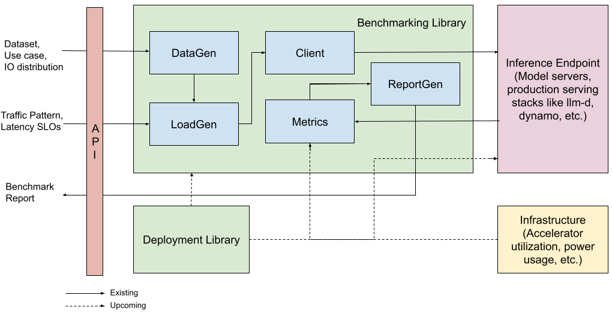
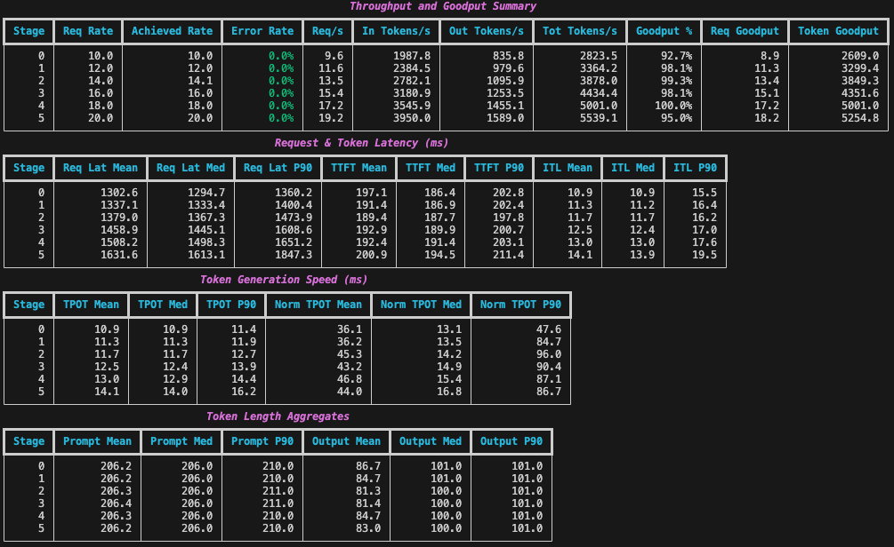

[](https://opensource.org/licenses/Apache-2.0)
[](https://github.com/kubernetes-sigs/inference-perf/releases/latest)
[](https://pypi.python.org/pypi/inference-perf)
[](https://quay.io/inference-perf/inference-perf)
[](https://github.com/kubernetes-sigs/inference-perf/actions/workflows/unit_test.yml)
[](https://kubernetes.slack.com/?redir=%2Fmessages%2Finference-perf)

# Inference Perf

Inference Perf is a production-scale GenAI inference performance benchmarking tool that allows you to benchmark and analyze the performance of inference deployments. It is agnostic of model servers and can be used to measure performance and compare different systems apples-to-apples.

It was founded as a part of the inference benchmarking and metrics standardization effort in [wg-serving](https://github.com/kubernetes/community/tree/master/wg-serving) to standardize the [benchmark tooling](https://github.com/kubernetes-sigs/wg-serving/tree/main/proposals/013-inference-perf) and the [metrics](https://docs.google.com/document/d/1SpSp1E6moa4HSrJnS4x3NpLuj88sMXr2tbofKlzTZpk/edit?usp=sharing&resourcekey=0-ob5dR-AJxLQ5SvPlA4rdsg) used to measure inference performance across the Kubernetes and model server communities.

---

## 🏗️ Architecture



---

## 🌟 Key Capabilities

### 📊 Rich Metrics & Analysis
- **Comprehensive Latency Metrics**: TTFT, TPOT, ITL, and Normalized TPOT.
- **Throughput Tracking**: Input, Output, and Total tokens per second.
- **Goodput Measurement**: Measure rate of requests meeting your SLO constraints. See [goodput.md](./docs/goodput.md).
- **Automatic Visualization**: Generate charts for QPS vs Latency/Throughput/Goodput. See [analysis.md](./docs/analysis.md).

### 🧠 Smart Data Generation
- **Real-world Datasets**: Support for ShareGPT, CNN DailyMail, Infinity Instruct and Billsum.
- **Synthetic & Random**: Configure exact input/output distributions.
- **Advanced Scenarios**: Shared prefix and multi-turn chat conversations.

### ⏱️ Flexible Load Generation
- **Load Patterns**: Constant rate, Poisson arrival, and concurrent user simulation.
- **Multi-Stage Runs**: Define stages with varying rates and durations to find saturation points.
- **Trace Replay**: Replay real-world traces (e.g., Azure dataset) or OpenTelemetry traces with agentic tree-of-thought simulation and visualization.

### 🚀 High Scalability
- **10k+ QPS**: Scalable to very high load due to optimized multi-process architecture.
- **Automatic Saturation Detection**: Find the limits of your system via sweeps.

### 🔌 Engine Agnostic
- Verified support for **vLLM**, **SGLang**, and **TGI** with server side aggregate metrics and time series metrics.
- Easily extensible to any OpenAI-compatible endpoint.

---

## 🚀 Quick Start

### Run Locally

1. Install `inference-perf`:
   ```bash
   pip install inference-perf
   ```

2. Run a benchmark with a simple random workload:
   ```bash
   inference-perf --server.type vllm --server.base_url http://localhost:8000 --data.type random --load.type constant --load.stages '[{"rate": 10, "duration": 60}]' --api.streaming true
   ```

Alternatively, you can run using a configuration file:
```bash
inference-perf --config_file config.yml
```

### Sample Output
When you run `inference-perf`, it displays a rich summary table in the CLI:



### Run in Docker
```bash
docker run -it --rm -v $(pwd)/config.yml:/workspace/config.yml quay.io/inference-perf/inference-perf
```

### Run in Kubernetes
Refer to the [guide](./deploy/README.md) in `/deploy`.

---

## 📚 Documentation Hub

Explore detailed documentation for specific topics:

| Topic | Description | Link |
| :--- | :--- | :--- |
| **Configuration** | Full YAML configuration schema and options. | [config.md](./docs/config.md) |
| **CLI Flags** | Overriding configuration via command line flags. | [cli_flags.md](./docs/cli_flags.md) |
| **Load Generation** | Detailed explanation of load patterns and multi-worker setup. | [loadgen.md](./docs/loadgen.md) |
| **Metrics** | Definitions of TTFT, TPOT, ITL, etc. | [metrics.md](./docs/metrics.md) |
| **Goodput** | How to measure requests meeting SLOs. | [goodput.md](./docs/goodput.md) |
| **Reports** | Understanding generated JSON reports. | [reports.md](./docs/reports.md) |
| **OTel Instrumentation** | OpenTelemetry integration for tracing. | [otel_instrumentation.md](./docs/otel_instrumentation.md) |
| **Analysis** | Visualizations and plots for performance metrics. | [analysis.md](./docs/analysis.md) |

---

## 🤝 Contributing & Community

We welcome contributions! Please join us:

- **Slack**: [#inference-perf](https://kubernetes.slack.com/?redir=%2Fmessages%2Finference-perf) channel in Kubernetes workspace.
- **Community Meeting**: Weekly on Thursdays alternating between 09:00 and 11:30 PDT.
- **Code of Conduct**: Governed by the [Kubernetes Code of Conduct](code-of-conduct.md).

See [CONTRIBUTING.md](CONTRIBUTING.md) for details on how to get started.
