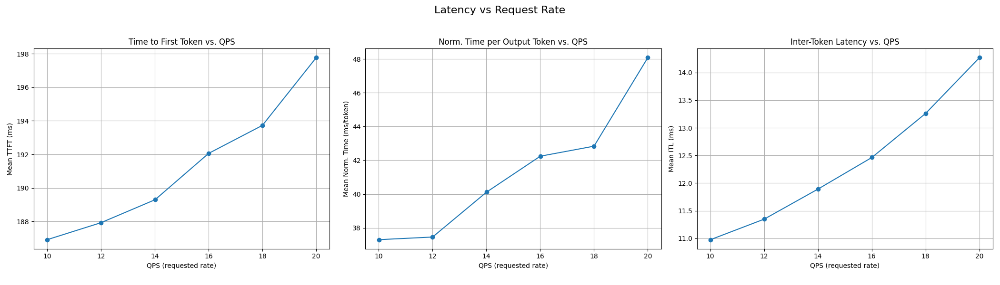
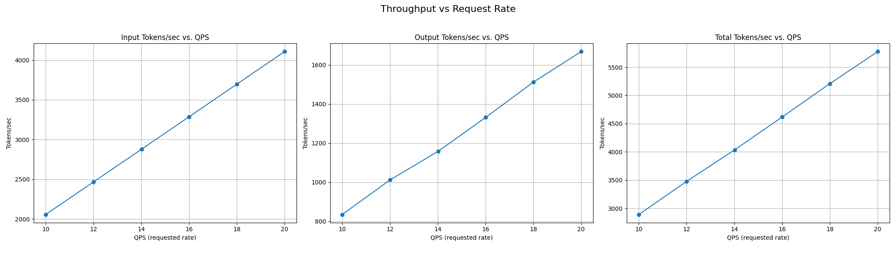
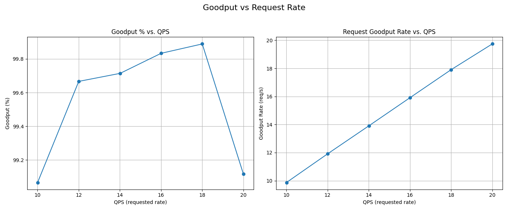
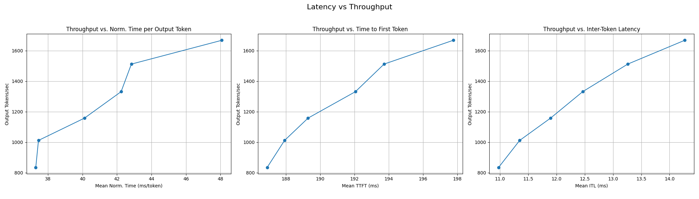

# Analyzing Benchmark Results

`inference-perf` provides a powerful analysis tool to visualize benchmark results across multiple stages or runs. This helps you understand system behavior under load and find optimal operating points.

## Generating Charts

To generate analysis charts, use the `--analyze` flag followed by the path to the directory containing your JSON reports:

```bash
inference-perf --analyze <path-to-reports-dir>
```

This command will read all `stage_*_lifecycle_metrics.json` files in the directory and generate a set of PNG charts.

## Available Charts

Here are the charts generated by running analysis on a recent benchmark run:

### 1. Latency vs Request Rate (QPS)
This chart shows how different latency metrics (TTFT, ITL, Norm. TPOT) scale as the request rate increases.



### 2. Throughput vs Request Rate (QPS)
This chart shows how input, output, and total token throughput scale with the requested rate.



### 3. Goodput vs Request Rate (QPS)
This chart shows the percentage of requests that met the goodput constraints (Goodput %) and the rate of good requests as QPS increases.



### 4. Latency vs Throughput Curve
This chart plots throughput against latency, which is useful for finding the "knee" where latency starts to degrade rapidly as throughput increases.


