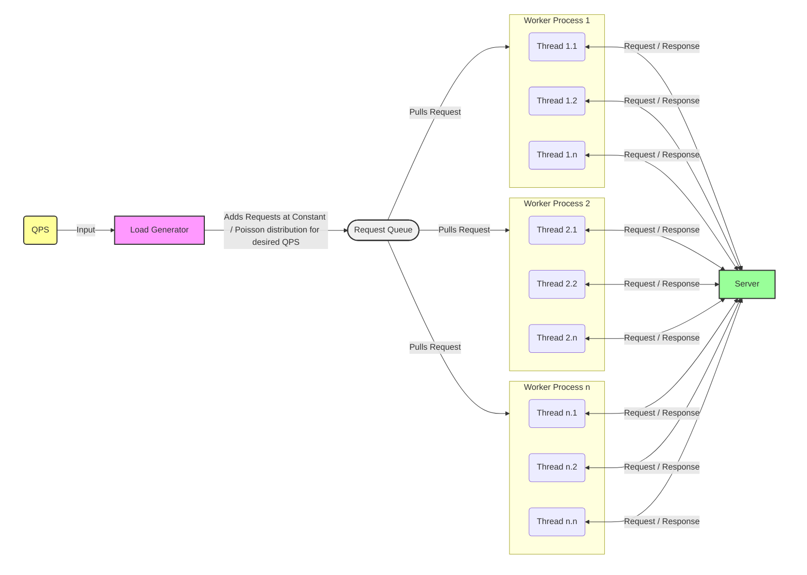

# Load Generation Guide

Inference Perf generates load at the specified request rate based on a multi-process architecture where it uses the total CPUs available to spin off as many processes as denoted by [`num_workers`](CONFIG.md#load-configuration) and within each process, it spins off as many threads as denoted by [`worker_max_concurrency`](CONFIG.md#load-configuration) to achieve the specified request rate. This multi-process archictecture allows inference-perf to scale to 10k+ QPS which is not possible otherwise.

## Architecture



## Recommended Configuration

Choose the right machine to run inference-perf on. The maximum concurrency you can get from the benchmarking tool and the ability to hit the desired QPS relies on the machine on which you are running on. Especially the number of CPUs / cores and the clock speed help with the concurrency. Maximum concurrency you can reach is bounded by `num_workers * worker_max_concurrency`. You can only have as many in-flight requests. Our recommendation is to not change `num_workers` since it is automatically set by inference-perf based on number of CPUs available and change `worker_max_concurrency` when needed. It is set to `100` by default. But more powerful CPUs can handle up to 1000.

You have the following options to generate load with inference-perf.

### Sweep request rates until saturation

1. Set the sweep option to true in the config file.
2. Choose linear (recommended) or gemoetric progression for request rates.

```
load:
  type: constant
  sweep:
    type: linear
```

Regardless of the serving stack, accelerator you are running on or the number of replicas, this will make sure it will generate different request rates until the server is saturated. Saturation detection is done by doing an initial run with a 1000 concurrent requests and identifying the maximum QPS the server can handle by looking at the burn rate. This QPS is then used as the upper bound for the sweep.

### Generate specific QPS

1. Set the desired request rate in the load generation config with the appropriate stages.
2. Choose the right machine as described above and set the `worker_max_concurrency` as appropriate.

This should allow the tool to generate the requested QPS.

```
load:
  type: constant
  stages:
  - rate: 100
    duration: 60
  num_workers: 32
  worker_max_concurrency: 250
```

### Run with specific concurrency instead of QPS

You might be interested in only specifying the concurrency (number of users) on the benchmarking side. In this case, modify `num_workers` and `worker_max_concurrency` in such a way that `num_workers * worker_max_concurrency` gives you the desired concurrency number. Then set the QPS really high so as to keep all the workers fully utilized.

For example, if you need to run with concurrency of 32 and you have 4 CPUs on your machine, set the following:
```
load:
  type: constant
  stages:
  - rate: 10000
    duration: 60
  num_workers: 4
  worker_max_concurrency: 8
```

## Troubleshooting

You can observe how accurate the tool is generating your desired load by looking at few things:

1. You can look at the config printed by inference-perf on startup to see what values were set for concurrency.

```
load:
  type: constant
  interval: 1.0
  stages:
  - rate: 1.0
    duration: 30
  sweep: null
  num_workers: 8
  worker_max_concurrency: 100
  worker_max_tcp_connections: 2500
```

2. You can look at the report to find the request rate (qps) achieved by the tool in sending the requests and the scheduling delay of how long the once queued a request had to wait. Ideally scheduling delay should be low (median delay should be less than 10 milliseconds) and the achieved rate should be very close to the specified rate for a fully accurate run.

```
  "load_summary": {
    "count": 30,
    "schedule_delay": {
      "mean": 0.0013255793989325564,
      "min": -0.00017004436813294888,
      "p0.1": -0.0001657977499999106,
      "p1": -0.00012757818680256605,
      "p5": -9.93020366877317e-06,
      "p10": 0.00017018378712236888,
      "p25": 0.000747388694435358,
      "median": 0.001130684744566679,
      "p75": 0.0018416460952721536,
      "p90": 0.0025742141995579006,
      "p95": 0.0027860384550876917,
      "p99": 0.0039429504936561,
      "p99.9": 0.004365706989075994,
      "max": 0.004412679933011532
    },
    "send_duration": 29.60411316808313,
    "requested_rate": 1.0,
    "achieved_rate": 1.0133726968840155
  },
```

If you notice issues with the delay or achieved rate, that means the benchmarking machine or the concurreny parameters need to be tweaked further.