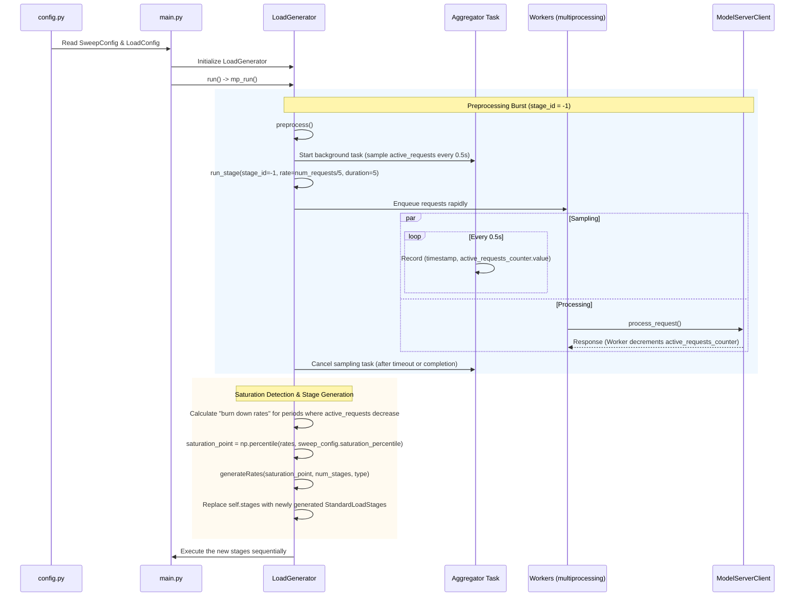

# Sweep Configuration and Behavior

The `sweep` feature in `inference-perf` automates the process of finding a target model server's maximum request processing rate (saturation point). Once this saturation point is found, the tool automatically generates a series of load stages to benchmark the server effectively up to that limit.

## Overview and Code Architecture

The core logic for the sweep functionality lives in `inference_perf/loadgen/load_generator.py`, primarily within the `LoadGenerator.preprocess` method, which is invoked by `mp_run()` when multiprocessing is used (which is standard for high-throughput load generation). The configuration for this feature is defined by the `SweepConfig` data model in `inference_perf/config.py`.

### Sweep Flow Diagram

The following Mermaid sequence diagram illustrates how the components interact to perform the sweep:



## How It Detects the Saturation Point

The `LoadGenerator.preprocess()` method uses a mathematically driven approach to estimate server saturation:

1. **The Burst:** The load generator fires a concentrated burst of requests by calling `self.run_stage(...)` with a `stage_id = -1`. It calculates the injection rate as `sweep.num_requests / 5` (injecting all requests over 5 seconds) but allows the stage to run up to `sweep.timeout` seconds to let the server process the backlog.
2. **Aggregator Sampling:** An asynchronous `aggregator()` task runs concurrently, waking up every 0.5 seconds to append a tuple of `(time.perf_counter(), active_requests_counter.value)` to a results list. `active_requests_counter` is a synchronized multiprocessing value incremented when a worker sends a request and decremented when a response is received.
3. **Burn Down Rate Calculation:** Once the burst completes or times out, the code filters the samples to exclude post-timeout drain. It then iterates through consecutive samples `(previous, current)` and calculates the rate of request completion (burn down rate) *only* when `current_requests < previous_requests`. The formula used is:
   `abs(current_requests - previous_requests) / (current_timestamp - previous_timestamp)`
   This yields a list of localized QPS values achieved by the server during periods where it was actively clearing the queue.
4. **Percentile Estimation:** The true saturation point is derived by taking the `sweep.saturation_percentile` (e.g., the 95th percentile) of these sampled burn down rates. This statistical approach smooths out brief spikes or lulls in server processing, providing a reliable upper bound for sustained throughput.
5. **Stage Generation:** Finally, `generateRates()` builds the new load stages (either `LINEAR` or `GEOMETRIC` spacing) up to the calculated saturation point, effectively replacing any manually configured stages.

## Workload Sensitivity and Saturation

A key advantage of the sweep feature is its sensitivity to the specific workload configuration. Because it actually measures how fast the server clears a backlog of *your specific requests*, the calculated saturation point will dynamically adapt to different workload types.

* **Data Generation & Token Lengths:** If your configuration uses a `DataGenType` that produces highly complex prompts or requires long output generations (e.g., high values in `output_distribution`), the server will naturally take longer to process each request. The aggregator will measure a slower "burn down rate," resulting in a lower, more realistic saturation QPS. Conversely, short token completions will yield a higher saturation point.
* **MultiLoRA Traffic Splitting (`lora_traffic_split`):** During the preprocessing burst, the `run_stage` function calls `self._get_lora_adapter()` to randomly assign LoRA adapters based on your configured probability weights. If your configuration forces the server to frequently context-switch between different LoRA weights, the processing overhead will be naturally captured during the burst, lowering the measured saturation point compared to a single-model baseline.
* **Circuit Breakers:** `inference-perf` strictly monitors the `self.circuit_breakers` list during the preprocessing burst. If the massive influx of requests causes a circuit breaker to trip (e.g., due to excessive queue times or high error rates), `run_stage` exits early. This fail-safe prevents the sweep from crashing the target server while still attempting to calculate a saturation point from the data gathered up to that moment.

## Configuration Parameters (`inference_perf/config.py`)

Sweep is configured within the `load.sweep` section of the YAML configuration file. Internally, this maps to the `SweepConfig` Pydantic model.

```yaml
load:
  type: constant  # Must be 'constant' or 'poisson'
  sweep:
    type: linear                # Progression type: 'linear' or 'geometric'
    num_requests: 2000          # Total number of requests for the preprocessing burst
    timeout: 60                 # Max duration in seconds for the preprocessing burst
    num_stages: 5               # Number of load stages to generate after finding saturation
    stage_duration: 180         # Duration in seconds for each generated stage
    saturation_percentile: 95   # Percentile of sampled completion rates to use as the saturation point
```

- **`type`** (`StageGenType`): The progression strategy for the generated stages. `linear` will generate evenly spaced request rates from 1.0 QPS up to the saturation point. `geometric` will generate rates clustered closer to the saturation point.
- **`num_requests`**: The number of requests injected during the preprocessing stage to saturate the server.
- **`timeout`**: The maximum time (in seconds) the preprocessing stage will run. If the server cannot process `num_requests` within this time, the sweep cancels remaining requests and calculates saturation based on completed requests.
- **`num_stages`**: The number of standard load stages to automatically generate.
- **`stage_duration`**: The length of time (in seconds) that each generated load stage will run.
- **`saturation_percentile`**: The percentile of the sampled "burn down rates" to use as the estimated saturation point. Higher values represent peak transient throughput, while lower values are more conservative.

### Note on Load Types
Sweep is **only supported** when `load.type` is set to `constant` or `poisson`. If you attempt to configure a `sweep` alongside a `concurrent` load type, Pydantic validation in `LoadConfig` will raise a `ValueError`.

## Viewing the Saturation Point

Once `inference-perf` has completed its run, the calculated saturation point isn't exposed as a single standalone field in the summary JSON file. Instead, you can find it in two places:

1. **Standard Output (Console Logs):**
   Immediately after the preprocessing burst finishes, the tool prints the calculated saturation point directly to the console:
   ```
   INFO    inference_perf.loadgen.load_generator:load_generator.py:478 Saturation point estimated at 125.40 concurrent requests.
   INFO    inference_perf.loadgen.load_generator:load_generator.py:488 Generated load stages: [25.08, 50.16, 75.24, 100.32, 125.4]
   ```

2. **Generated Reports (`stage_N_lifecycle_metrics.json`):**
   Because sweep generates a series of load stages that mathematically progress up to the saturation point, the **final generated stage** effectively runs at the exact saturation limit.

   If you set `num_stages: 5`, locate the JSON report for the final stage (e.g., `stage_4_lifecycle_metrics.json`). Within this file, look for the `load_summary` block. The `requested_rate` matches the calculated saturation point:
   ```json
   {
     "load_summary": {
       "count": 22572,
       "send_duration": 180.0,
       "requested_rate": 125.40,
       "achieved_rate": 124.98
     }
   }
   ```
